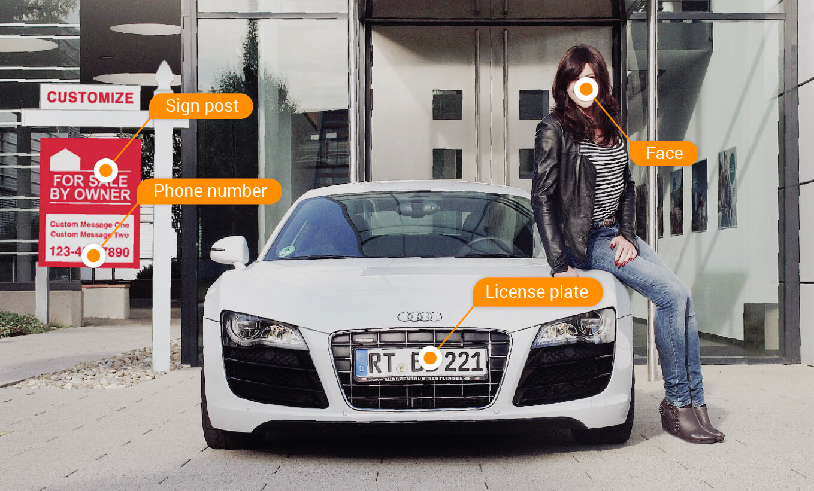
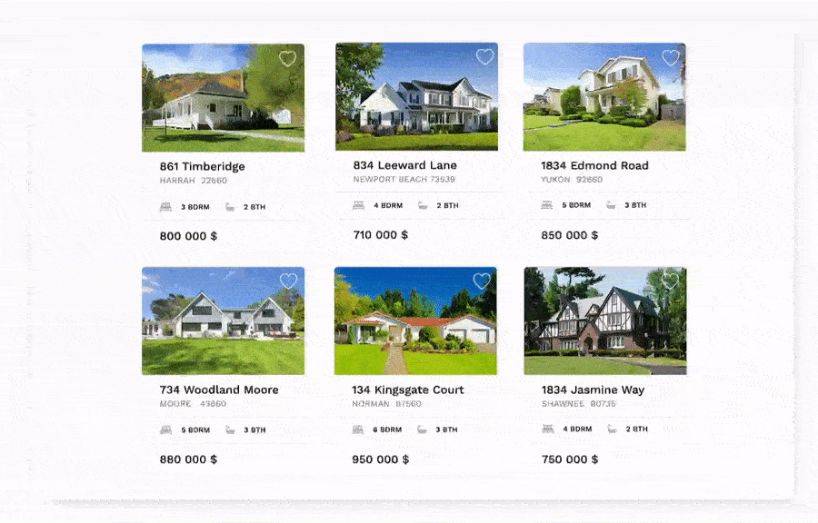

 

  

 

# HackUPC 2022

💻 Useful documentation for [Restb.ai](https://restb.ai/) 's presence in HackUPC 2022

[Website](https://restb.ai/) | [API Documentation](https://docs.restb.ai/) | [Real-time Demo](https://demo.restb.ai/real-estate/) | [Slack channel](https://hackupc2022.slack.com/archives/C039F1TRJDV)

## 🏢 What's Restb.ai

Restb.ai is an AI technological services provider that specializes in **Computer Vision** for Real Estate. Our solutions identify, categorize and deliver results on property-related images to reinvent user experiences, enhance big data models and automate the moderation of digital content. All solutions are accessible via a simple RESTful API interface.

Feel free to contact any of our engineers through our Slack channel [#restbai](https://hackupc2022.slack.com/archives/C039F1TRJDV). Ask us anything, we don't bite!😜

## 💪 Our Challenge

Build your project using one (or more) of our available **AI Computer Vision APIs**. From Real Estate CV classification solutions to a broad collection of object and features detection models. Our API is waiting for you!

To get a free API key come visit us at our booth; we promise we are really friendly and would love to chat with you about anything that comes to your mind! For more details, please check our [docs page](https://docs.restb.ai)

## ✨ Our solutions

You will get access to two of our APIs: *Vision* and *Property*. Vision is an image-based API while Property is, as its own name says, a property-based API.

### 📸 Vision API

Restb.ai provides its Computer Vision service via a RESTful API web service. The API is built upon a simple premise: you send image URLs to the service and it returns AI computed results. The type of result returned is based on the model specified for processing the image. For more details, check our [API documentation](https://docs.restb.ai/)

#### 🏷 Classification

There is incredible value in understanding the type of a given photo, particularly in this age of automation. Knowing whether a photo is tagged as an exterior view, kitchen or floor plan can be the difference between a steamlined user experience and complete confusion. Unfortunately, the sheer volume and turnover of photos on real estate websites make it impossible to do this manually. Our computer vision models automatically classify images in the following:

- 60+ **Room types** (Kitchen, Front of house, Floor plans, etc.)
- 25+ **Exterior Home styles** (Ranch, Victorian, Cape Cod, etc.)

#### 🎯 Feature detection 

Beyond the type of a given photo, there is even more value in the details of a photo. As opposed to generic computer vision models, our AI only derives real estate specific insights. Therefore we identify both easily observable features, like hardwood floors, and more context specific items, like the presence of natural light. All of these enhance your ability to match the relevant content to your customers. Our current offerings include:

- 20+ **Interior home features** (Fireplaces, Exposed bricks, etc.)
- 20+ **Exterior home features** (Pool, Mountain view, Deck, etc.)
- 40+ **Advanced features** (Kitchen features, Home appliances, etc.)

#### 👩 Photo compliance

The largest real estate sites can receive upwards of 1 million new images a day. Is your moderation team struggling to keep up? Tirelessly scan millions of photos with A.I. to flag images containing:

- People and faces
- ‘For Sale’ sign posts (branding)
- Phone numbers
- Email addresses
- License plates

#### 🔍 Watermark detection

Keeping your website watermark-free is a difficult and time-consuming task. Many companies start with a manual moderation team, but as their sites grow, there simply are not enough resources. 100% coverage becomes both an impossible task and an exorbitant cost. Instead, utilize our automated computer vision solution to programmatically detect all watermarks instantly.

#### 📈 AI Photo enhancement

Every day there are thousands of property images taken with inadequate lighting and outdated smartphones, which results in subpar images being uploaded to real estate sites.

Restb.ai’s Photo Enhancement Solution allows you to automatically detect image quality issues and enhance your photos in real-time for a fraction of the cost of existing services.

- Blurriness reduction
- Color enhancement
- Brightness correction
- Contrast correction
- Saturation correction

#### 1️⃣ Use case #1 - Automatically extract information

This use case is coming from one of our top clients, the Spanish Real Estate portal [Idealista](https://www.idealista.com/). They are using our Room Type solution for automatically extracting information when photos are added or uploaded. This approach saves agents time by auto-populating fields based on image data and ensures consistent and high quality data across all listings.

#### 2️⃣ Use case #2 - Search by Features

Let’s say you’ve begun your search for a new home.  The recent quarantine has made you rediscover your love for cooking and you can’t wait to see what’s on the market.
What if you could choose the default photo that appears with your search results? Users no longer have to click into each listing and scroll countless photos

This picture above is coming from the American Portal [2FINDYOURHOME](https://www.2findyourhome.com/search/?orderby=ListPrice&orderbydirection=DESC&page_number=1&propertytype=sf&skip=0&view=maplist) 

#### 3️⃣ Use case #3 - Email personalization with image tags

You want to search for a property with specific features? Like for example you would like to buy a house with a pool and an outdoor kitchen. 

For this reason you wouldn't want to be notified with available properties that do not have those characteristics. The portal can use the feature extraction to match the aspects you are more interested in. 

#### 4️⃣ Use case #4 - Compare specific Room Types

At the end you only care about certain spaces. With our Room Type classification you would be able to Align images by room type when comparing your favorite properties. By doing so, the portal allows users to easily compare properties based on their visual appeal and prevent users from having to click through dozens of photos across multiple tabs.

This particular example is an animation from the American Site [Cloud CMA](https://cloudcma.com/real-estate-agents)

### 🏠 Property API

Restb.ai's Property API service provides information via a RESTful API web service. The API is built upon our existing Computer Vision AI solutions, and supports multiple property analysis like scoring homes based on the condition of their kitchen, bathroom, interior and exterior images.
For more details, check our [documentation](https://docs.restb.ai/property)

#### 👩‍🍳 Property Condition

Anyone who has worked in real estate understands there are massive price swings between similar houses of varying quality. Unfortunately, while most people know the difference when they see it, it is difficult to apply at scale. That’s why we built a model to detect the condition (Disrepair, poor, average, good, excellent or luxury) of various real estate photos. It’s perfect to enhance your AVM, to source ideal properties for renovation or to narrow down lists of comparables. Our current API analyze a property’s:

- Bathroom and kitchen conditions
- Interior and exterior conditions
- Overall condition

The image above shows the images of a listing and their corresponding condition scores including the average score for every room type.

This solution is being used for our clients in order to evaluate the improvements of a property, if a house has been renovated, or even it's also helpful for understanding how much the condition improves after a renovation of a house.

You can find a practical example in the [torii portal](https://www.toriihomes.com/search?filters=%7B%22minDaysOnMarket%22%3A0%2C%22daysOnMarket%22%3A100000%2C%22hasGarageSpaces%22%3Afalse%2C%22maxAge%22%3A1800%2C%22maxHOA%22%3A0%2C%22minAge%22%3A2022%2C%22minBath%22%3A0%2C%22minBr%22%3A0%2C%22minParking%22%3A0%2C%22openHousesOnly%22%3Afalse%2C%22propType%22%3A%5B%5D%2C%22sqFeetRange%22%3A%5B500%2C600%2C700%2C800%2C900%2C1000%2C1250%2C1500%2C1750%2C2000%2C2250%2C2500%2C3000%2C3500%2C4000%2C4500%2C5000%5D%2C%22photosByRoom%22%3A%22%22%2C%22conditionsByRoomType%22%3A%22%5B%7B%5C%22rt%5C%22%3A%5C%22kitchen%5C%22%2C%5C%22rc%5C%22%3A%5B2%5D%7D%5D%22%2C%22location%22%3A%2242.360082500000004%2C-71.05888010000001%22%2C%22boundingBox%22%3A%2242.40731444918141%2C-70.96532464956054%2C42.31281502055425%2C-71.15243555043945%22%2C%22zoom%22%3A13%7D&location=42.360082500000004%2C-71.05888010000001&view=map) where they apply our Property Condition to search the property that suits better your budget and needs.
